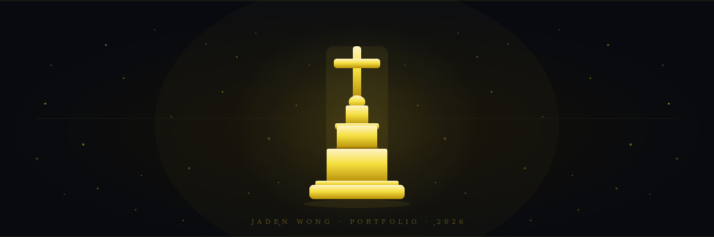

# Portfolio - Jaden Wong




Personal portfolio site for Jaden Wong - 16-year-old ML engineer and researcher from Toronto, Ontario.

---

## Stack

| Layer | Tech |
|---|---|
| Framework | React 19 + Vite 8 |
| Routing | React Router DOM 7 |
| 3D / Graphics | Three.js, Canvas API |
| Styling | Plain CSS + inline styles |
| Deployment | Vercel |

---

## Pages

| Route | Description |
|---|---|
| `/` | Home - hero, bio, stats, 3D chess showcase, research + project previews |
| `/about` | About - timeline, experience cards, DNA helix 3D scene, skill proficiency charts, EMG pipeline diagram |
| `/research` | Research - technical report with accuracy visualizations, 11 articles, 3 lesson plans |
| `/work` | Work - project showcase with 3D rotunda, publications |
| `/contact` | Contact - direct email, status card, embedded Tally form |

---

## Features

- **Three.js scenes** - DNA double helix, chess piece rotunda, particle character animations
- **Data visualizations** - SVG accuracy gauge, per-gesture accuracy bars, skill proficiency bars, EMG pipeline diagram - all built without a charting library
- **14 CSS critter characters** - hand-crafted in pure CSS, each independently animated
- **Immersive scroll** - parallax CJK backgrounds, particle warp star field, cinematic entrance animations
- **Page progress bar** - gold fill bar tracks scroll position across all pages

---

## Local dev

```bash
npm install
npm run dev
```
